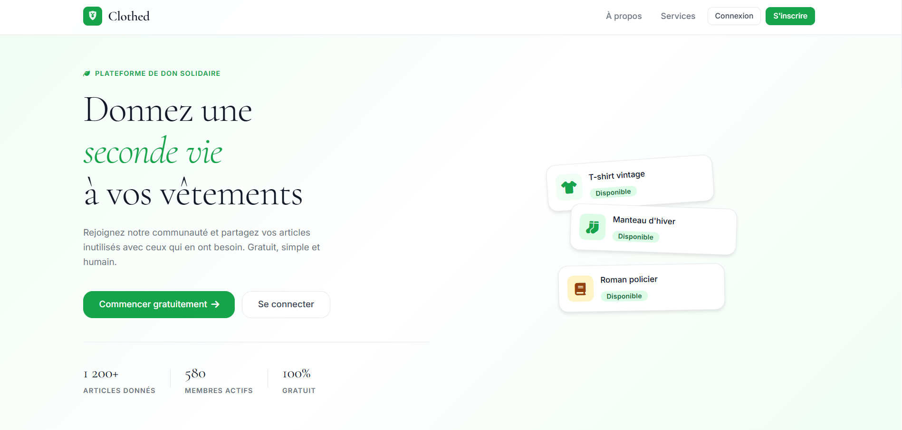
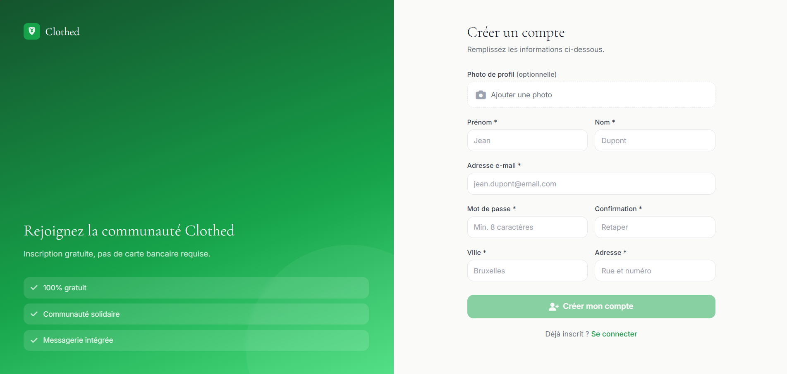
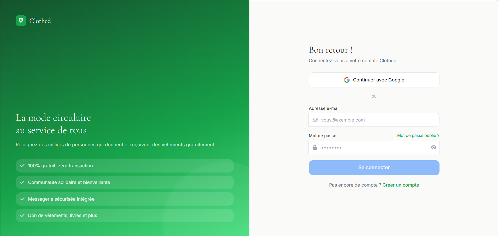
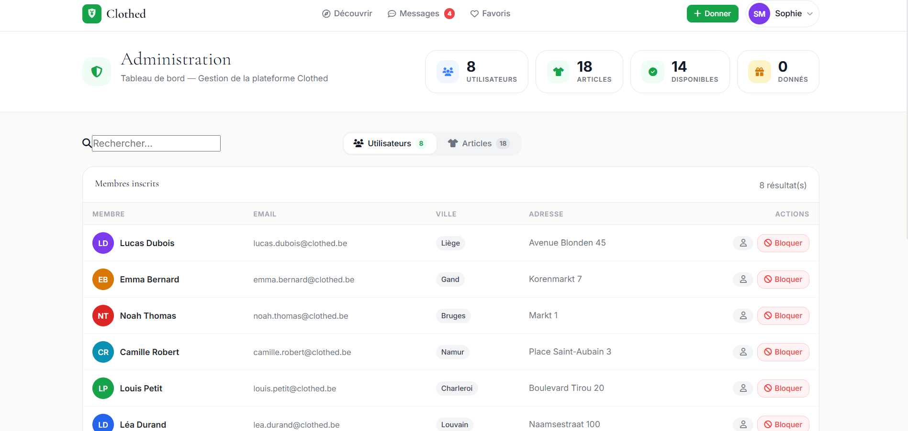

# 🌿 Clothed — Plateforme de don de vêtements solidaire


> **Clothed** est une plateforme full-stack de don de vêtements entre particuliers.  
> Projet universitaire — INFOB318 · Université de Liège · 2024

---

## 📸 Aperçu

| Page d'accueil | Découvrir les articles |
|---|---|
|  |  |

| Inscription | Connexion |
|---|---|
|  |  |

| Administration |
|---|
|  |

---

## ✨ Fonctionnalités

- 🔐 **Authentification** — Inscription avec confirmation e-mail, connexion sécurisée, mot de passe oublié
- 📦 **Articles** — Publication avec upload d'images, catégories, statuts (libre / retenu / donné)
- 💬 **Messagerie** — Chat en temps réel entre donateurs et demandeurs
- ❤️ **Favoris** — Sauvegarde et gestion des articles favoris
- 👤 **Profils** — Profil public de chaque donateur avec ses articles
- 🛡️ **Administration** — Dashboard avec KPIs, gestion des utilisateurs et articles
- 📱 **Responsive** — Interface adaptée mobile, tablette et desktop

---

## 🛠 Stack technique

| Couche | Technologies |
|---|---|
| **Frontend** | Angular 15, TypeScript, Angular Material, CSS Variables |
| **Backend** | Node.js, Express, TypeScript, Multer (upload fichiers) |
| **Base de données** | MySQL, Sequelize ORM |
| **Auth** | bcryptjs, confirmation par e-mail |

---

## 🚀 Lancer le projet

### Prérequis
- Node.js ≥ 18
- MySQL
- Angular CLI (`npm install -g @angular/cli`)

### 1. Cloner le repo
```bash
git clone https://github.com/TON_USERNAME/clothed-app.git
cd clothed-app
```

### 2. Configurer la base de données
```sql
CREATE DATABASE clothed_db;
```
Modifier `backend/config/config.json` avec vos identifiants MySQL.

### 3. Lancer le backend
```bash
cd backend
npm install
npm install multer @types/multer bcryptjs @types/bcryptjs
npm run start
# → http://localhost:5000
```

### 4. Lancer le frontend
```bash
cd ..
npm install
ng serve
# → http://localhost:4200
```

### 5. (Optionnel) Remplir la base de données avec des données de démo
```bash
cd backend
node seed.js
# Crée 8 utilisateurs, 17 articles, favoris et messages
# Mot de passe de tous les comptes : Clothed123!
```

---

## 📁 Structure du projet

```
clothed-app/
├── src/                    # Frontend Angular
│   ├── app/
│   │   ├── composant/      # Composants réutilisables
│   │   ├── views/          # Pages principales
│   │   ├── services/       # Services Angular
│   │   └── models/         # Interfaces TypeScript
│   └── styles.css          # Design system global
├── backend/
│   ├── src/
│   │   ├── server.ts       # Serveur Express + routes API
│   │   └── articlerouter.ts
│   ├── models/             # Modèles Sequelize
│   ├── uploads/            # Images uploadées (généré au runtime)
│   └── seed.js             # Script de données de démo
└── screenshots/            # Captures d'écran
```

---

## 👤 Compte administrateur (après seed)

| Champ | Valeur |
|---|---|
| Email | `sophie.martin@clothed.be` |
| Mot de passe | `Clothed123!` |
| URL Admin | `http://localhost:4200/admin` |

---

## 📄 Licence

Ce projet est sous licence [MIT](LICENSE).  
© 2024 — Projet académique INFOB318
